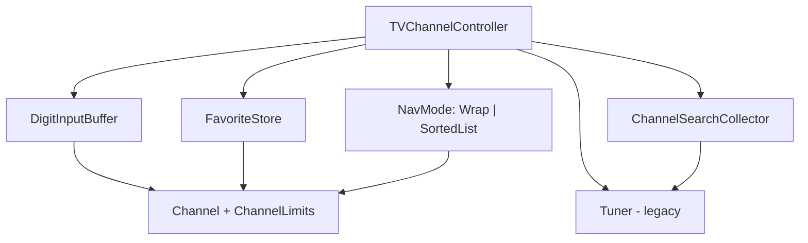

# 08. TVChannelController 모던 C++ 리팩토링 계획 보고서

작성일: 2026-05-19

## 1. 목적

본 보고서는 `TVChannelController`에 대한 **모던 C++ 리팩토링 실행 계획**을 단계별 체크리스트·커밋 단위·검증 방법과 함께 정리한다. 분석 근거는 코드 품질 보고서이며, **동작 변경 없이** 구조만 개선하는 것을 전제로 한다.

| 구분 | 설명 |
|------|------|
| 역할 | 리팩토링 코치 — 실행 계획·검증 절차 |
| 대상 | `include/TVChannelController.h` 및 신규 `include/channel/*` (또는 `include/detail/*`) |
| 제약 | `Tuner`, `TVController`, `remoteKey` **수정 금지**; 채널 **0~99** |
| 진행 조건 | **모든 테스트 Green** 상태에서만 다음 단계 진행 |
| 기준 문서 | `TDD_TV_Requirements.txt` §4.3, `docs/code_quality_report.md` |

**관련 산출물**

| 문서 | 경로 | 역할 |
|------|------|------|
| 개발 요구사항 | `TDD_TV_Requirements.txt` | FR-01~06 |
| 코드 품질 분석 | `Report/03_TVChannelController_Code_Quality_Report.md` | SOLID/스멜·우선순위 |
| 결함 분석 | `Report/06_TVChannelController_Defect_Analysis_Report.md` | FR 구현·Green 기준 |
| 단위 테스트 | `test/TVControllerTest.cpp` | 44 `TEST_F` |
| Golden 회귀 | `test/TVControllerGoldenTest.cpp` | FR 시나리오 14건 |
| 본 보고서 | `Report/08_TVChannelController_Refactoring_Plan_Report.md` | 단계별 실행 계획 |

---

## 2. 현재 상태 요약

### 2.1 구현 규모

| 항목 | 값 |
|------|-----|
| 파일 | `include/TVChannelController.h` (~154줄) |
| 공개 API | `pressNumber`, `pressConfirm`, `pressOther`, `pressFavorite`, `addFavorite`, `getFavoriteChannels`, `pressNextFavorite`, `pressChannelSearch`, `pressChannelUp`, `pressChannelDown`, `getSearchedChannels` |
| 멤버 | `buffer`, `favorites`, `searchedChannels`, `tuner_` |

### 2.2 테스트·검증 현황

```powershell
cd c:\DEV\TDD_TV_11
cmake --build build
ctest --test-dir build --output-on-failure
```

| 항목 | 값 |
|------|-----|
| ctest 전체 | **71** (TunerTest + TVControllerTest + TVControllerGoldenTest) |
| 기대 상태 | **전부 Green** (리팩터 시작 전 필수) |

선택 회귀 강화:

```powershell
.\build\TVControllerGoldenTest.exe
```

Golden 실패 시 **동작 변경** 가능성이 있으므로, 의도적 변경이 아니면 코드를 롤백한다. 승인본 갱신은 `cmake --build build --target update_golden` (명시적 결정 후).

### 2.3 리팩터링 동기 (요약)

| 영역 | 현상 | 개선 방향 |
|------|------|-----------|
| Tuner 문자열 변환 | `std::stoi` / `std::to_string` 다수 중복 | `Channel` 값 객체 + 게이트웨이 |
| 숫자 입력 | `pressNumber` 중첩 `if`, 매직 넘버 2·3·9 | `DigitInputBuffer` + 정책 테이블 |
| 즐겨찾기 | find/insert·erase 분기 | `FavoriteStore::toggle` |
| 채널 탐색 | `pressChannelUp`/`Down`에 `searchedChannels.empty()` 분기 | `NumericWrapNavigation` / `SortedListNavigation` |
| 채널 검색 | `pressChannelSearch` 루프·정렬 인라인 | `ChannelSearchCollector` |
| 채널 다운 | 이중 `lower_bound`/`upper_bound` (가장 복잡) | `SortedListNavigation::down` 통합 |

### 2.4 FR-01-04 동작 고정 (리팩터 시 주의)

세 자리 입력 `'4','5','6'` 시나리오는 다음 순서로 Green이 유지된다.

1. `'4','5'` → 2자리 자동 적용 → **45번**, 버퍼 **clear**
2. `'6'` → 버퍼 `[6]` (새 1자리)
3. `pressConfirm` → **6번**

즉 3번째 숫자는 “연속 3자리 버퍼”가 아니라 **2자리 적용 후 리셋된 뒤의 1자리**이다. `DigitInputBuffer` 추출 시 이 의미를 테스트(`ThreeDigits_*`, `Press1234`)와 Golden `fr01_*`로 고정한다.

---

## 3. 리팩토링 원칙

1. **테스트 Green 유지** — 한 커밋마다 `cmake --build build && ctest --test-dir build --output-on-failure`
2. **동작 변경과 구조 변경 분리** — 명세 변경·버그 수정은 별 PR/커밋
3. **작고 되돌리기 쉬운 커밋** — 실패 시 `git revert` 한 번으로 단계 롤백
4. **레거시 보호** — `Tuner`/`TVController`/`remoteKey` 미수정; 채널 변경은 `tuner_` 경로만
5. **매직 넘버 상수화** — `0..99`, `0..9`, `100`, `2`, `3` → `constexpr` 명명 상수

---

## 4. 목표 아키텍처



`TVChannelController`는 **조합(composition)** 계층으로 유지하고, `press*` 메서드는 각 컴포넌트에 위임한다.

---

## 5. 단계별 실행 계획

### Phase 0 — 기준선 고정 (코드 변경 없음)

| # | 체크리스트 | 완료 |
|---|------------|------|
| 0.1 | `ctest --test-dir build` 전체 Green | ☐ |
| 0.2 | `TVControllerGoldenTest` Green | ☐ |
| 0.3 | (선택) `git tag refactor-baseline` | ☐ |

**검증:** 공통 명령 2회 연속 통과.

---

### Commit 1 — 도메인 상수 + `Channel` 값 객체

**목적:** 매직 넘버 제거, Tuner ↔ 정수 변환 단일화.

| # | 작업 | 완료 |
|---|------|------|
| 1.1 | `include/channel/ChannelLimits.h` — `kMinChannel`, `kMaxChannel`, `kChannelCount`, `kMinDigit`, `kMaxDigit`, `kAutoApplyDigits`, `kMaxBufferDigits` | ☐ |
| 1.2 | `include/channel/Channel.h` — `fromTuner`, `toTunerString`, `isValid` | ☐ |
| 1.3 | `TVChannelController` 내부 `stoi`/`to_string` → `Channel` (public API 시그니처 유지) | ☐ |

**검증 테스트:** `FavoriteAtChannel0`, `FavoriteAtChannel99`, `ChannelUp_NoSearch_Wrap99to0`, `ChannelDown_NoSearch_Wrap0to99`

**커밋 메시지 예:** `refactor: introduce Channel value object and channel constants`

---

### Commit 2 — Tuner 게이트웨이 (private)

**목적:** Duplicated Code·Feature Envy 제거.

| # | 작업 | 완료 |
|---|------|------|
| 2.1 | `Channel currentChannel() const` | ☐ |
| 2.2 | `void setChannel(Channel ch)` | ☐ |
| 2.3 | `applyBuffer`, `pressFavorite`, `pressNextFavorite`, `pressChannelUp`/`Down`가 게이트웨이만 사용 | ☐ |

**검증 테스트:** `FavoriteToggleScenario`, `NextFavorite_*`, `ChannelUp/Down_NoSearch_*`

**커밋 메시지 예:** `refactor: centralize tuner read/write via Channel gateway`

---

### Commit 3 — `DigitInputBuffer` 추출 (FR-01)

**목적:** `pressNumber` 조건 분기 축소, 입력 정책 OCP.

| # | 작업 | 완료 |
|---|------|------|
| 3.1 | `DigitInputBuffer` — `pushDigit`, `confirm`, `clear`, `composeValue` | ☐ |
| 3.2 | `constexpr` 정책: 2자리 → 즉시 적용, 연속 3자리(방어) → discard, 1자리+확인 → 적용 | ☐ |
| 3.3 | `pressNumber` — 유효성(`0..9`) + 버퍼 위임 | ☐ |

**검증 테스트:** `Press1234`, `ThreeDigits_*`, `Zero7`, `MaxChannel99`  
**Golden:** `fr01_*`

**커밋 메시지 예:** `refactor: extract DigitInputBuffer with digit input policy`

---

### Commit 4 — `FavoriteStore` (FR-02)

**목적:** SRP, `pressFavorite` 분기 제거.

| # | 작업 | 완료 |
|---|------|------|
| 4.1 | `FavoriteStore::toggle(int)` (C++17 `insert` 반환 활용) | ☐ |
| 4.2 | `add`, `view()` — `getFavoriteChannels()`는 기존 `vector` 복사 유지 | ☐ |

**검증 테스트:** `FavoriteAdd_*`, `FavoriteToggle_*`  
**Golden:** `fr02_favorite_toggle_scenario`

**커밋 메시지 예:** `refactor: extract FavoriteStore with toggle semantics`

---

### Commit 5 — `nextInSortedRing` 유틸 (FR-03 / FR-06 공통)

**목적:** 정렬 컨테이너 순환 탐색 중복 제거.

| # | 작업 | 완료 |
|---|------|------|
| 5.1 | `nextStrictlyGreater` — 없으면 begin (wrap) | ☐ |
| 5.2 | `prevInSortedRing` — down 로직 통합 전 단계 | ☐ |
| 5.3 | `pressNextFavorite` 단순화 | ☐ |

**검증 테스트:** `NextFavorite_*`  
**Golden:** `fr03_*`

**커밋 메시지 예:** `refactor: add sorted-ring navigation helpers for favorites`

---

### Commit 6 — `ChannelSearchCollector` (FR-04)

**목적:** `pressChannelSearch` Long Method 격리.

| # | 작업 | 완료 |
|---|------|------|
| 6.1 | `collectViaSeek(Tuner&)` → 정렬된 `vector<int>` | ☐ |
| 6.2 | `pressChannelSearch()` — 수집 결과 할당만 | ☐ |

**검증 테스트:** `ChannelSearch_*`, `ChannelSearchMockTest`  
**Golden:** `fr04_*`

**커밋 메시지 예:** `refactor: extract ChannelSearchCollector from pressChannelSearch`

---

### Commit 7 — 네비게이션 전략 분리 (FR-05 / FR-06)

**목적:** `searchedChannels.empty()` 분기를 타입으로 표현 (OCP).

| # | 작업 | 완료 |
|---|------|------|
| 7.1 | `NumericWrapNavigation` — `% kChannelCount` up/down | ☐ |
| 7.2 | `SortedListNavigation` — `upper_bound`/`lower_bound` + wrap | ☐ |
| 7.3 | `std::variant<NumericWrapNavigation, SortedListNavigation>` 멤버 | ☐ |
| 7.4 | `pressChannelSearch` 시 SortedList 모드 전환 | ☐ |

**검증 테스트:** FR-05 전체, `ControllerSearchListTest`  
**Golden:** `fr05_*`, `fr06_*`

**커밋 메시지 예:** `refactor: split channel navigation into wrap vs sorted-list strategies`

---

### Commit 8 — `pressChannelDown` 분기 평탄화

**목적:** 가장 높은 순환 복잡도 구간 정리 (Commit 7 이후).

| # | 작업 | 완료 |
|---|------|------|
| 8.1 | `SortedListNavigation::down` — on-list / off-list 통합 | ☐ |
| 8.2 | `pressChannelDown` → `setChannel(nav.down(current))` 수준 | ☐ |

**검증 테스트:** `ChannelDown_WithSearch_*`, `ChannelUpDown_WithSearch_FullCycle`

**커밋 메시지 예:** `refactor: flatten pressChannelDown via SortedListNavigation`

---

### Commit 9 — C++17 스타일 정리 (동작 불변)

| # | 작업 | 완료 |
|---|------|------|
| 9.1 | `[[nodiscard]]` on getter | ☐ |
| 9.2 | `explicit` 생성자, `= default` 정리 | ☐ |
| 9.3 | early return 패턴 유지 (가독성) | ☐ |

**검증:** 전체 `ctest` + Golden

**커밋 메시지 예:** `refactor: apply C++17 style polish without behavior change`

---

### Commit 10 (선택) — 구현 분리

**조건:** Commit 1~9 안정 후.

| # | 작업 | 완료 |
|---|------|------|
| 10.1 | `TVChannelController.cpp` 또는 `detail/*.cpp` 분리 | ☐ |
| 10.2 | `getFavoriteChannels` 반환 최적화 — 테스트 호환 시에만 | ☐ |

---

## 6. FR ↔ 컴포넌트 추적 매트릭스

| FR | 요구 요약 | 리팩터 후 담당 | 대표 검증 |
|----|-----------|----------------|-----------|
| FR-01 | 숫자 버튼 채널 변경 | `DigitInputBuffer` | `Press1234`, `ThreeDigits_*`, Golden `fr01_*` |
| FR-02 | 선호 채널 토글 | `FavoriteStore` | `FavoriteToggle*`, Golden `fr02_*` |
| FR-03 | 다음 선호 채널 | `nextInSortedRing` | `NextFavorite_*`, Golden `fr03_*` |
| FR-04 | 채널 검색 | `ChannelSearchCollector` | `ChannelSearchMockTest`, Golden `fr04_*` |
| FR-05 | 업/다운 (검색 없음) | `NumericWrapNavigation` | `ChannelUp/Down_NoSearch_*`, Golden `fr05_*` |
| FR-06 | 업/다운 (검색 있음) | `SortedListNavigation` | `ControllerSearchListTest`, Golden `fr06_*` |

---

## 7. 공통 검증 절차

### 7.1 매 커밋 후 (필수)

```powershell
cmake --build build
ctest --test-dir build --output-on-failure
```

### 7.2 실패 시 대응

| 증상 | 조치 |
|------|------|
| `TVControllerTest` 실패 | 해당 FR 테스트·구현 diff 확인; 커밋 롤백 또는 최소 수정 |
| `TVControllerGoldenTest` 실패 | 동작 변경 여부 확인; 의도 없으면 롤백 |
| 빌드 실패 | 신규 헤더 `include_directories` / CMake `target` 소스 추가 확인 |

### 7.3 권장 진행 순서

```
Phase 0 → Commit 1 → 2 → 3 → 4 → 5 → 6 → 7 → 8 → 9 → (10)
```

Commit 7·8은 분리 유지(Up/Down 전략 도입 후 Down만 평탄화).

---

## 8. 리스크 및 완화

| 리스크 | 영향 | 완화 |
|--------|------|------|
| FR-01-04 버퍼 의미 오해 | 3자리·확인 시나리오 회귀 | Commit 3에서 Golden + `ThreeDigits_*` 필수 |
| `pressChannelDown` 로직 변경 | FR-06 off-list/on-list 오류 | Commit 8 단독, `ControllerSearchListTest` 전체 |
| God Class 재발 | 새 FR마다 `if` 증가 | 신규 기능은 `NavMode`/Store/Buffer 확장만 |
| Golden 승인본 drift | CI 실패 | 의도적 변경 시에만 `update_golden` |

---

## 9. 완료 정의 (리팩터링 Phase)

- [ ] Commit 1~9 완료, 각 단계 `ctest` Green
- [ ] `TVControllerGoldenTest` Green (승인본 무변경 또는 문서화된 갱신)
- [ ] `Tuner` / `TVController` / `remoteKey` diff 없음
- [ ] `TVChannelController` public API 시그니처 유지 (테스트·Golden 호환)
- [ ] `docs/code_quality_report.md` §6 우선순위 1~4 항목 반영

---

## 10. 참고 코드 위치

| 구간 | 파일 | 라인(대략) |
|------|------|------------|
| 버퍼 적용 | `include/TVChannelController.h` | 16–27 |
| 숫자 입력 분기 | `include/TVChannelController.h` | 34–50 |
| 즐겨찾기 토글 | `include/TVChannelController.h` | 57–66 |
| 다음 즐겨찾기 | `include/TVChannelController.h` | 76–88 |
| 채널 검색 | `include/TVChannelController.h` | 92–105 |
| 채널 업 | `include/TVChannelController.h` | 107–121 |
| 채널 다운 | `include/TVChannelController.h` | 123–149 |

---

*본 문서는 실행 계획이며, 실제 리팩터링 적용 후 `Report/01`·`Report/03`의 테스트 개수·구조 설명을 갱신할 수 있다.*
