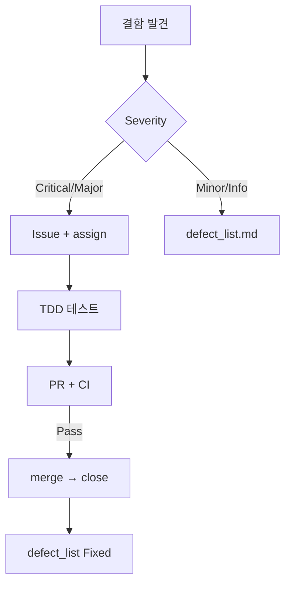
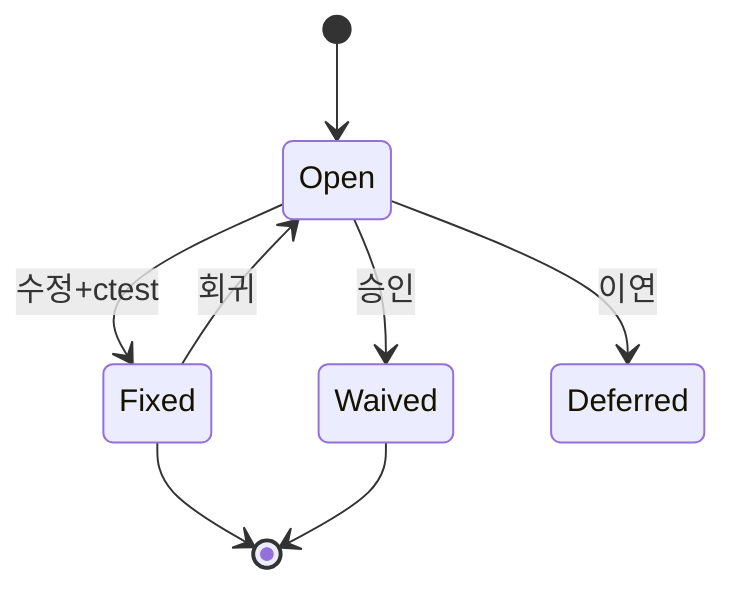

# 09. 결함 관리 보고서

작성일: 2026-05-19

## 1. 목적

본 보고서는 TDD_TV_11 프로젝트의 **결함 분류 체계**, **결함 보고서 작성 표준**, **품질 메트릭 수집 계획**, **(선택) GitHub Issues 연동**을 QA 리드 관점에서 정리한다. 개별 결함 등록·상세 재현 절차는 [`docs/defect_list.md`](../docs/defect_list.md), 운영용 동일 본문은 [`docs/defect_report.md`](../docs/defect_report.md)를 참조한다.

| 구분 | 설명 |
|------|------|
| 역할 | QA Lead — 결함 관리·품질 메트릭 |
| 대상 | `TVChannelController`, `test/TVControllerTest.cpp`, Golden Master 회귀 |
| 기준 | `TDD_TV_Requirements.txt`, `docs/test_plan.md`, ctest/Green Master |
| 제약 | `Tuner`, `TVController`, `remoteKey` 수정 금지 |

**관련 산출물**

| 문서 | 경로 | 역할 |
|------|------|------|
| 결함 목록 (상세) | `docs/defect_list.md` | DEF-001~014 재현·수정 이력 |
| 결함 관리 가이드 | `docs/defect_report.md` | 본 보고서와 동기화된 운영 문서 |
| 결함 분석 | `Report/06_TVChannelController_Defect_Analysis_Report.md` | ctest 실패·함수별 원인 |
| 테스트 계획 | `Report/04_Test_Plan_Report.md`, `docs/test_plan.md` | P0/P1·커버리지 |
| Golden 회귀 | `Report/07_Golden_Master_Regression_Test_Report.md` | trace baseline |
| 리팩토링 계획 | `Report/08_TVChannelController_Refactoring_Plan_Report.md` | Green 유지 개선 |
| QA 최종 종합 | `Report/10_QA_Final_Report.md`, `docs/qa_final_report.md` | 9단계 평가·커버리지·Best Practice |
| 개발 요구사항 | `TDD_TV_Requirements.txt` | FR-01~06, DoD |

---

## 2. 현재 품질·결함 현황

### 2.1 테스트 실행

```powershell
cmake --build build
ctest --test-dir build --output-on-failure
```

| 항목 | 값 |
|------|-----|
| 전체 테스트 | **57** |
| 성공 | **57** |
| 실패 | **0** |
| 상태 | **Green** (HEAD) |

### 2.2 결함 등록 요약 (DEF-001~014)

| Severity | Fixed | Open | Waived | 합계 |
|----------|-------|------|--------|------|
| Critical | 3 | 0 | 0 | 3 |
| Major | 1 | 0 | 0 | 1 |
| Minor | 1 | 7 | 0 | 8 |
| Info | 0 | 3 | 1 | 4 |
| **합계** | **5** | **8** | **1** | **14** |

| ItemType | 건수 | Open |
|----------|------|------|
| Missing Implementation | 3 | 0 |
| Bug | 2 | 0 |
| Specification Gap | 2 | 2 |
| Test Gap | 4 | 4 |
| Technical Debt | 3 | 2 (+1 Waived) |

**핵심:** P0 기능 결함(DEF-001~005)은 수정·검증 완료. 잔여 Open은 **명세 정렬·P1 테스트·커버리지·기술 부채** 위주.

### 2.3 요약 매트릭스 (발췌)

| ID | Severity | ItemType | Status | 연관 FR |
|----|----------|----------|--------|---------|
| DEF-001~003 | Critical | Missing Implementation | Fixed | FR-04~06 |
| DEF-004 | Major | Bug | Fixed | FR-01-04 |
| DEF-005 | Minor | Bug | Fixed | FR-01-04 |
| DEF-006~007 | Minor | Specification Gap | Open | FR-01 |
| DEF-008~009, 013 | Minor/Info | Technical Debt | Open / Waived | FR-01, FR-02 |
| DEF-010, 011, 014 | Minor | Test Gap | Open | FR-01, P1 |
| DEF-012 | Info | Test Gap | Open | DoD (90% coverage) |

전체 필드·재현 절차: [`docs/defect_list.md`](../docs/defect_list.md).

---

## 3. 결함 분류 체계

### 3.1 Severity (심각도)

| 등급 | 정의 | 릴리스 영향 | 대응 SLA (권장) | 예시 |
|------|------|-------------|-----------------|------|
| **Critical** | 핵심 FR 미구현·전면 실패 | **릴리스 차단** | 즉시 (당일) | DEF-001~003 |
| **Major** | 주요 FR 일부 오동작 | **릴리스 차단** | 1 영업일 | DEF-004 |
| **Minor** | 경계·예외·문서 불일치 | 수정 권장 | 3 영업일 | DEF-006~007, 010 |
| **Info** | 기술 부채·측정 미실시 | **Waived 가능** | 백로그 | DEF-008, 012, 013 |

### 3.2 ItemType (5종)

| ItemType | 정의 | 수정 주체 |
|----------|------|-----------|
| **Bug** | 명세·테스트 대비 구현 오류 | Dev |
| **Missing Implementation** | 요구·테스트 대비 기능 미구현 | Dev |
| **Specification Gap** | 문서·코드·테스트 명세 불일치 | QA + PO/Dev |
| **Test Gap** | 검증 테스트·P1 시나리오 부재 | QA / Dev |
| **Technical Debt** | 동작은 맞으나 설계·성능 개선 필요 | Dev (리팩토링) |

### 3.3 Severity × ItemType 매트릭스

기호: **●** 빈번, **○** 드묾, **—** 비권장

|  | **Bug** | **Missing Impl.** | **Spec Gap** | **Test Gap** | **Tech Debt** |
|--|:---:|:---:|:---:|:---:|:---:|
| **Critical** | ○ | **●** DEF-001~003 | — | — | — |
| **Major** | **●** DEF-004 | ○ | ○ | — | — |
| **Minor** | **●** DEF-005 | — | **●** DEF-006, 007 | **●** DEF-010, 011, 014 | **●** DEF-009 |
| **Info** | — | — | — | **●** DEF-012 | **●** DEF-008, 013 |

#### 처리 정책

| Severity \ ItemType | Bug | Missing Impl. | Spec Gap | Test Gap | Tech Debt |
|---------------------|-----|---------------|----------|----------|-----------|
| Critical | 즉시 수정, ctest Green | TDD Red→Green | 명세 확정 후 정렬 | — | — |
| Major | 회귀 테스트 후 수정 | 동 Critical | 문서 + characterization test | — | — |
| Minor | P1 스프린트 | — | 단일 SoT 문서 | `TEST_F` 추가 | 리팩토링 백로그 |
| Info | — | — | 문서화 | CI 커버리지 게이트 | Waived / Phase R |

### 3.4 상태 (Status)

| 상태 | 설명 |
|------|------|
| **Open** | 미해결·후속 작업 |
| **Fixed** | 수정·ctest 검증 완료 (커밋 해시 기록) |
| **Waived** | 범위상 수용 (사유·승인자) |
| **Deferred** | 스프린트·리팩토링 단계 이연 |

---

## 4. 결함 보고서 템플릿

결함 1건당 아래 구조로 등록한다. 상세 예시: DEF-004 in [`docs/defect_list.md`](../docs/defect_list.md).

### 4.1 메타데이터

| 필드 | 내용 |
|------|------|
| **ID** | DEF-XXX |
| **Severity** | Critical / Major / Minor / Info |
| **ItemType** | 5종 중 택 1 |
| **Status** | Open / Fixed / Waived / Deferred |
| **발견 단계** | Unit / Golden / Code Review / CI |
| **연관 FR** | FR-xx-xx |
| **연관 TEST_F** | `TestName` (`test/TVControllerTest.cpp:줄`) |
| **수정 커밋** | `abcdef0` (Fixed 시) |

### 4.2 본문 (재현 / 기대 / 실제 / 원인 / 수정 / 검증)

| 섹션 | 작성 요령 |
|------|-----------|
| **재현** | FakeTuner 설정 → API 시퀀스 → 관측 (`currentCh()`, `getSearchedChannels()`) |
| **기대** | FR ID 또는 `TEST_F` Then, 구체적 값 |
| **실제** | 관측값, ctest 로그 발췌 |
| **원인** | 함수·라인, ItemType 근거 |
| **수정** | 최소 변경, 수정 금지 대상 준수 |
| **검증** | ctest Green, Golden, (선택) lcov |

**검증 체크리스트**

- [ ] `ctest` 전체 Green
- [ ] 관련 `TEST_F` 통과
- [ ] `TVControllerGoldenTest` 회귀 (해당 시)
- [ ] `docs/defect_list.md` Status 갱신

### 4.3 작성 예시 — DEF-004

| 섹션 | 내용 |
|------|------|
| 재현 | `4,5,6` → CH 45 → `pressOther()` |
| 기대 | CH **45** 유지 |
| 실제 | CH **0** |
| 원인 | `pressOther()` → `setCH("0")` |
| 수정 | `buffer.clear()`만 |
| 검증 | Green, `61c68e6` |

---

## 5. 품질 메트릭 수집 계획

### 5.1 메트릭 정의

| ID | 이름 | 정의 | 목표 (DoD) | 주기 |
|----|------|------|------------|------|
| **QM-01** | 테스트 통과율 | passed / total × 100 | **100%** | 커밋·PR·CI |
| **QM-02** | Line Coverage | `TVChannelController` 라인 커버 | **≥ 90%** | PR·릴리스 |
| **QM-03** | Branch Coverage | 분기 커버 | **≥ 85%** | 주 1회 |
| **QM-04** | 단계별 결함 발견율 | 단계별 신규 Open ÷ 총 결함 | 추적 | 스프린트 |
| **QM-05** | 결함 밀도 | Open ÷ KLOC | 감소 추세 | 월간 |
| **QM-06** | 수정률 | Fixed ÷ (Fixed+Open) | Critical/Major **100%** | 릴리스 |
| **QM-07** | 회귀 결함 | Fixed 후 재발 | **0** (P0) | Golden·CI |

### 5.2 단계별 결함 발견율

| 단계 | 활동 | 전형 ItemType | 사례 |
|------|------|---------------|------|
| T1 단위 (Red) | 신규 `TEST_F` | Missing Impl., Bug | DEF-001~003 |
| T2 단위 (Green) | 최소 구현 | Bug | DEF-004, 005 |
| T3 경계·예외 (P1) | B4~B7, E1~E2 | Test Gap | DEF-010, 011, 014 |
| T4 Golden 회귀 | trace diff | Bug (회귀) | — |
| T5 리팩토링 | Green 유지 | Tech Debt | DEF-008 |
| T6 리뷰·명세 | 문서 대조 | Spec Gap | DEF-006, 007 |
| T7 CI·커버리지 | lcov 게이트 | Test Gap | DEF-012 |

**현재 분포 (DEF-001~014):**

| 단계 | 건수 | 비율 |
|------|------|------|
| T1 | 5 | 36% |
| T3 | 3 | 21% |
| T5/T6 | 3 | 21% |
| T6 명세 | 2 | 14% |
| T7 | 1 | 7% |

목표: Critical/Major **80%+** 를 T1~T2에서 조기 발견.

### 5.3 커버리지 도구 (언어별)

| 언어 | 도구 | 게이트 |
|------|------|--------|
| **C++** (본 프로젝트) | **gcov + lcov** / Windows: **gcovr** | line ≥ 90% |
| Java | JaCoCo | 팀 정책 (예: 80%) |
| Python | pytest-cov | line ≥ 90% |

**C++ 측정 절차 (요약):**

```bash
cmake -B build-cov -DENABLE_COVERAGE=ON -DCMAKE_BUILD_TYPE=Debug
cmake --build build-cov
ctest --test-dir build-cov --output-on-failure
./build-cov/TVControllerTest
lcov --capture --directory build-cov --output-file coverage.info
lcov --remove coverage.info '/usr/*' '*/googletest/*' '*/test/*' -o coverage.filtered.info
genhtml coverage.filtered.info -o coverage_html
```

상세: `docs/test_plan.md` §7, `docs/defect_report.md` §4.4.

### 5.4 DoD 품질 게이트 (현재)

| # | 기준 | 현재 |
|---|------|------|
| 1 | FR-01~06 `TEST_F` | ✅ 57 tests |
| 2 | ctest Green | ✅ QM-01 100% |
| 3 | P1 B4~B7, E1~E2 | ⚠️ DEF-010, 011, 014 |
| 4 | Line ≥ 90% | ⚠️ DEF-012 미측정 |
| 5 | Golden 회귀 | ✅ |
| 6 | 레거시 미변경 | ✅ |

---

## 6. (선택) GitHub Issues 연동

### 6.1 라벨

`severity:critical|major|minor|info`, `type:bug|missing-impl|spec-gap|test-gap|tech-debt`, `status:fixed|waived`

### 6.2 워크플로우



| 이벤트 | 동작 |
|--------|------|
| PR | `Fixes #NNN` / `Closes DEF-XXX` |
| CI | `.github/workflows/ci.yml` — ubuntu + windows `ctest` |
| (권장) | Coverage job — `ENABLE_COVERAGE=ON`, artifact 업로드 |

Issue template·CI 스니펫 전문: [`docs/defect_report.md`](../docs/defect_report.md) §5.

---

## 7. 결함 생명주기



---

## 8. 결론 및 권장 조치

| 우선순위 | 조치 | 담당 | 연관 DEF |
|----------|------|------|----------|
| P0 | (완료) FR-04~06·`pressOther` Green 유지 | Dev | DEF-001~005 |
| P1 | 예외·세 자리 P1 `TEST_F` 추가 | QA | DEF-010, 011, 014 |
| P1 | `ENABLE_COVERAGE` + lcov baseline, 90% 게이트 | Dev/CI | DEF-012 |
| P2 | FR-01-04 명세 단일화 (README vs `.cursorrules`) | PO/QA | DEF-006 |
| P2 | Report/08 리팩토링 단계에서 Tech Debt | Dev | DEF-008, 009 |

**산출물 정리**

- **본 보고서** (`Report/09_*`): 분류·템플릿·메트릭·GitHub — 이해관계자용 요약
- **운영 가이드** (`docs/defect_report.md`): 템플릿 전문·CI YAML·Issue template
- **결함 레지스터** (`docs/defect_list.md`): DEF-001~014 상세

---

## 9. 변경 이력

| 버전 | 날짜 | 변경 내용 |
|------|------|-----------|
| 1.0 | 2026-05-19 | 초안 — 분류 매트릭스, 템플릿, QM, GitHub, 현황 요약 |
