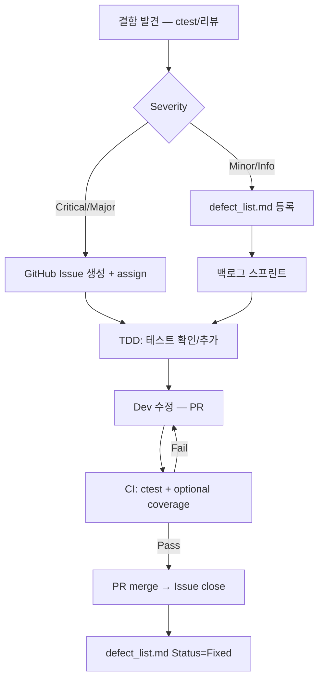
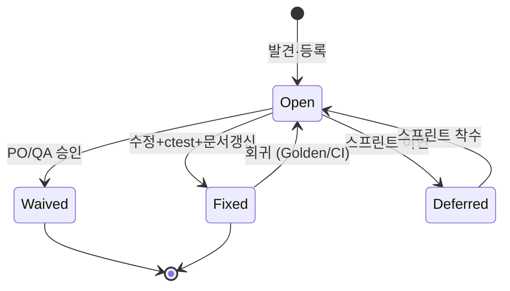

# 결함 관리 보고서 — TDD_TV_11

| 항목 | 내용 |
|------|------|
| **문서 ID** | QA-DEF-REPORT-001 |
| **버전** | 1.0 |
| **작성일** | 2026-05-19 |
| **작성 역할** | QA Lead Engineer |
| **대상** | `TVChannelController`, `test/TVControllerTest.cpp`, Golden Master 회귀 |
| **관련 문서** | `Report/09_Defect_Management_Report.md`, `docs/defect_list.md`, `docs/test_plan.md`, `TDD_TV_Requirements.txt` |
| **현재 품질 스냅샷** | ctest **57/57 Green** (HEAD) |

---

## 1. 문서 목적

본 문서는 TDD_TV_11 프로젝트의 **결함 분류 체계**, **결함 보고서 작성 표준**, **품질 메트릭 수집 계획**, **(선택) GitHub Issues 연동**을 정의한다. 개별 결함 상세 목록은 [`docs/defect_list.md`](defect_list.md)를 참조한다.

---

## 2. 결함 분류 체계

### 2.1 Severity (심각도)

| 등급 | 정의 | 릴리스 영향 | 대응 SLA (권장) | 예시 (본 프로젝트) |
|------|------|-------------|-----------------|-------------------|
| **Critical** | 핵심 FR 미구현·전면 실패. ctest 다수 실패 또는 P0 시나리오 불가 | **릴리스 차단** | 즉시 (당일) | DEF-001~003: FR-04~06 API no-op |
| **Major** | 주요 FR 일부 오동작. 단일·소수 테스트 실패, 우회 가능성 낮음 | **릴리스 차단** | 1 영업일 | DEF-004: `pressOther()`가 CH 0으로 리셋 |
| **Minor** | 경계·예외·문서 불일치. 기능 대부분 동작, P1 항목 | 수정 권장 | 3 영업일 | DEF-006~007: 명세 불일치, DEF-010: 예외 테스트 부재 |
| **Info** | 기술 부채·측정 미실시·범위 외. 기능 영향 없음 | **Waived 가능** | 백로그 | DEF-008, DEF-012, DEF-013 |

### 2.2 ItemType (결함 유형) — 5종

| ItemType | 정의 | 전형적 증상 | 수정 주체 | 추적 키 |
|----------|------|-------------|-----------|---------|
| **Bug** | 명세·테스트에 부합하는 기대 동작 대비 **구현 오류** | Green 테스트 실패, 기대≠실제 | Dev | FR-xx, `TEST_F` |
| **Missing Implementation** | 요구사항·테스트는 있으나 **기능 미구현** (스텁/no-op) | 다수 `EXPECT_EQ` 실패, API 부재 | Dev | FR-xx |
| **Specification Gap** | README·요구사항·코드·테스트 간 **명세 불일치** | 테스트 Green이나 문서 상 충돌 | QA + PO/Dev | FR-xx, 문서 ID |
| **Test Gap** | 구현은 있으나 **검증 테스트 부재** 또는 P1 시나리오 미작성 | 커버리지·예외 분기 미검증 | QA (테스트) / Dev | `TEST_F` 계획 ID |
| **Technical Debt** | 동작은 맞으나 **설계·성능·유지보수** 개선 필요 | 리뷰·프로파일링에서 발견 | Dev (리팩토링 단계) | Report/03 등 |

### 2.3 Severity × ItemType 매트릭스

표의 셀은 **해당 조합의 전형적 심각도·처리 우선순위**를 나타낸다.  
기호: ● = 해당 조합 빈번, ○ = 드묾, — = 해당 없음(이론상 가능하나 본 프로젝트에서 비권장)

|  | **Bug** | **Missing Implementation** | **Specification Gap** | **Test Gap** | **Technical Debt** |
|--|:---:|:---:|:---:|:---:|:---:|
| **Critical** | ○ (핵심 경로 전면 오류) | **●** DEF-001~003 | — | — | — |
| **Major** | **●** DEF-004 | ○ | ○ | — | — |
| **Minor** | **●** DEF-005 | — | **●** DEF-006, 007 | **●** DEF-010, 011, 014 | **●** DEF-009 |
| **Info** | — | — | — | **●** DEF-012 | **●** DEF-008, 013 |

#### 2.3.1 매트릭스별 처리 정책

| Severity \ ItemType | Bug | Missing Implementation | Specification Gap | Test Gap | Technical Debt |
|---------------------|-----|------------------------|-------------------|----------|----------------|
| Critical | 즉시 수정, ctest Green 필수 | TDD Red→Green, API 추가 | 명세 확정 후 테스트·구현 정렬 | — | — |
| Major | 회귀 테스트 추가 후 수정 | 동 Critical | 문서 개정 + characterization test | — | — |
| Minor | P1 스프린트 | — | 단일 SoT 문서 선정 | `TEST_F` 추가 (Green 유지) | 리팩토링 백로그 |
| Info | — | — | 문서화만 | CI 커버리지 게이트 | Waived 또는 리팩토링 단계 |

### 2.4 상태 (Status) 정의

| 상태 | 설명 |
|------|------|
| **Open** | 미해결 또는 후속 작업 필요 |
| **Fixed** | 수정·`ctest` 검증 완료 (커밋 해시 기록 권장) |
| **Waived** | 명세·범위상 수용 (사유·승인자 기록) |
| **Deferred** | 다음 스프린트·리팩토링 단계로 이연 |

---

## 3. 결함 보고서 템플릿

아래 템플릿을 복사하여 결함 1건당 작성한다. 상세 기록 예시는 [`docs/defect_list.md`](defect_list.md) DEF-001~014를 따른다.

### 3.1 메타데이터

```markdown
## DEF-XXX

| 필드 | 내용 |
|------|------|
| **ID** | DEF-XXX |
| **제목** | [한 줄 요약 — 모듈·증상] |
| **Severity** | Critical / Major / Minor / Info |
| **ItemType** | Bug / Missing Implementation / Specification Gap / Test Gap / Technical Debt |
| **Status** | Open / Fixed / Waived / Deferred |
| **발견 단계** | Unit / Integration / Regression (Golden) / Code Review / Static Analysis |
| **발견일** | YYYY-MM-DD |
| **보고자** | 이름 또는 역할 |
| **담당** | Dev / QA |
| **연관 FR** | FR-xx-xx (해당 시) |
| **연관 TEST_F** | `TestName` (`test/TVControllerTest.cpp:줄`) |
| **수정 커밋** | `abcdef0` (Fixed 시) |
| **GitHub Issue** | #NNN (연동 시) |
```

### 3.2 본문 — 재현 / 기대 / 실제 / 원인 / 수정 / 검증

```markdown
### 재현 (Steps to Reproduce)

1. [전제 조건 — FakeTuner 채널 목록, 초기 CH 등]
2. [사용자/API 동작 시퀀스]
3. [관측 지점 — `currentCh()`, `getSearchedChannels()` 등]

### 기대 결과 (Expected)

- [요구사항 ID 또는 TEST_F Then 절]
- [구체적 값 — 예: CH `45` 유지]

### 실제 결과 (Actual)

- [관측값 — 예: CH `0`]
- [ctest 로그 발췌 — `Expected equality... Which is: 0`]

### 근본 원인 (Root Cause)

- [함수·라인 — 예: `pressOther()` → `tuner_.setCH("0")`]
- [분류 근거 — Bug vs Missing Implementation 등]

### 수정 방안 (Fix Summary)

- [최소 변경 설명]
- [수정 금지 대상 준수 여부 — Tuner/TVController/remoteKey]

### 검증 (Verification)

- [ ] `ctest` 전체 Green
- [ ] 관련 `TEST_F` 통과 (목록)
- [ ] Golden Master 회귀 (해당 시 `TVControllerGoldenTest`)
- [ ] 회귀 없음 확인 (수정 전 실패 케이스 재실행)
- [ ] (선택) gcov/lcov — 변경 라인 커버
```

### 3.3 작성 예시 (요약) — DEF-004

| 섹션 | 내용 |
|------|------|
| **재현** | `4,5,6` 입력 → CH 45 → `pressOther()` |
| **기대** | CH **45** 유지 (`ThreeDigits_ThenOther_ClearsSix`) |
| **실제** | CH **0** |
| **원인** | `pressOther()`가 `buffer.clear()` 후 `setCH("0")` 호출 |
| **수정** | `buffer.clear()`만 수행 |
| **검증** | `ctest` Green, 커밋 `61c68e6` |

---

## 4. 품질 메트릭 수집 계획

### 4.1 메트릭 정의

| 메트릭 ID | 이름 | 정의 | 목표 (DoD) | 수집 주기 |
|-----------|------|------|------------|-----------|
| **QM-01** | 테스트 통과율 | `passed / (passed + failed) × 100` (ctest) | **100%** | 매 커밋·PR·CI |
| **QM-02** | Line Coverage | 실행된 라인 / 총 라인 (`TVChannelController`) | **≥ 90%** | PR merge 전·릴리스 |
| **QM-03** | Branch Coverage | 분기 커버 (선택) | **≥ 85%** | 주 1회·릴리스 |
| **QM-04** | 단계별 결함 발견율 | 해당 단계에서 **신규 Open** 결함 수 ÷ 총 결함 수 | 추적·개선 (목표치 없음) | 스프린트 종료 |
| **QM-05** | 결함 밀도 | Open 결함 수 ÷ KLOC (또는 public API 수) | 감소 추세 | 월간 |
| **QM-06** | 수정률 | Fixed ÷ (Fixed + Open) × 100 | Critical/Major **100%** | 릴리스 전 |
| **QM-07** | 회귀 결함 수 | Fixed 후 재발 Open 건수 | **0** (P0) | Golden·CI |

### 4.2 단계별 결함 발견율 (Defect Detection by Phase)

TDD_TV_11 권장 테스트 단계와 결함 유입·발견 매핑:

| 단계 | 활동 | 발견 ItemType (전형) | 본 프로젝트 사례 |
|------|------|----------------------|------------------|
| **T1 — 단위 (Red)** | `TVControllerTest` 신규 `TEST_F` | Missing Implementation, Bug | DEF-001~003 (FR-04~06) |
| **T2 — 단위 (Green)** | 최소 구현 후 ctest | Bug (세부 로직) | DEF-004, DEF-005 |
| **T3 — 경계·예외 (P1)** | B1~B7, E1~E2 추가 | Test Gap, Bug | DEF-010, DEF-011 |
| **T4 — 회귀 (Golden)** | `TVControllerGoldenTest` vs baseline | Bug (회귀) | Golden trace diff |
| **T5 — 리팩토링** | Green 유지 리팩토링 | Technical Debt | DEF-008 |
| **T6 — 정적·리뷰** | 코드 리뷰, 문서 대조 | Specification Gap, Technical Debt | DEF-006, DEF-007 |
| **T7 — CI·커버리지** | lcov/gcov 게이트 | Test Gap (측정) | DEF-012 |

**발견율 계산 예:**

```
단계 T1 발견율 = (T1에서 최초 등록된 결함 수) / (총 등록 결함 수) × 100%
```

현재 [`defect_list.md`](defect_list.md) 기준 (DEF-001~014):

| 단계 | 건수 | 비율 |
|------|------|------|
| T1 단위 (Red/Green) | 5 (DEF-001~005) | 36% |
| T3 경계·예외 | 3 (DEF-010, 011, 014) | 21% |
| T6 리뷰·명세 | 2 (DEF-006, 007) | 14% |
| T5/T6 기술부채 | 3 (DEF-008, 009, 013) | 21% |
| T7 커버리지 | 1 (DEF-012) | 7% |

> **목표:** Critical/Major는 **T1~T2**에서 80% 이상 조기 발견 (시프트-레프트).

### 4.3 테스트 통과율 수집

**로컬 / CI:**

```bash
cmake --build build
ctest --test-dir build --output-on-failure
```

| 산출물 | 경로·형식 |
|--------|-----------|
| ctest XML | `build/Testing/*/Test.xml` |
| 요약 | `N tests passed, M failed` |
| Golden | `TVControllerGoldenTest` 별도 실행 |

**통과율 기록 템플릿 (스프린트 로그):**

| 날짜 | Total | Passed | Failed | Pass % | 비고 |
|------|-------|--------|--------|--------|------|
| 2026-05-19 | 57 | 57 | 0 | 100% | HEAD Green |

### 4.4 커버리지 수집 — 언어별 도구

본 프로젝트 **주 스택: C++17 (gcov/lcov)**. 다언어·타 레포 확장 시 아래 표준을 따른다.

| 언어 | 도구 | 빌드/실행 | 리포트 | 게이트 (권장) |
|------|------|-----------|--------|---------------|
| **C++** | **gcov + lcov** (GCC/Clang) | `ENABLE_COVERAGE=ON`, Debug | `genhtml` → HTML | line ≥ 90% |
| **C++ (Windows)** | **gcovr** (MinGW) | 동일 | `gcovr --html` | 동일 |
| **C++ (MSVC)** | OpenCppCoverage | Visual Studio 빌드 | GUI/XML export | 별도 기준 |
| **Java** | **JaCoCo** | Maven `jacoco-maven-plugin` / Gradle `jacoco` | `report.xml`, HTML | line ≥ 80% (팀 정책) |
| **Python** | **pytest-cov** | `pytest --cov=pkg --cov-report=html` | `htmlcov/`, `coverage.xml` | line ≥ 90% |

#### 4.4.1 C++ — gcov/lcov 절차 (TDD_TV_11)

`docs/test_plan.md` §7과 동일. 요약:

```bash
# Linux / WSL
cmake -B build-cov -DENABLE_COVERAGE=ON -DCMAKE_BUILD_TYPE=Debug
cmake --build build-cov
cd build-cov && ctest --output-on-failure
./TVControllerTest
lcov --capture --directory . --output-file coverage.info
lcov --remove coverage.info '/usr/*' '*/googletest/*' '*/test/*' \
     --output-file coverage.filtered.info
genhtml coverage.filtered.info --output-directory coverage_html
lcov --summary coverage.filtered.info
```

```powershell
# Windows (MinGW-w64)
cmake -B build-cov -G "MinGW Makefiles" -DENABLE_COVERAGE=ON
cmake --build build-cov
.\build-cov\TVControllerTest.exe
gcovr -r .. --html --html-details -o coverage.html
```

**측정 범위:** `include/TVChannelController.h` 구현부.  
**제외:** `TVController.h`, `Tuner.h`, `remoteKey.h`, `test/*`, googletest.

#### 4.4.2 Java — JaCoCo (참고)

```xml
<!-- pom.xml 예시 -->
<plugin>
  <groupId>org.jacoco</groupId>
  <artifactId>jacoco-maven-plugin</artifactId>
  <executions>
    <execution>
      <goals><goal>prepare-agent</goal></goals>
    </execution>
    <execution>
      <id>report</id>
      <phase>test</phase>
      <goals><goal>report</goal></goals>
    </execution>
  </executions>
</plugin>
```

#### 4.4.3 Python — pytest-cov (참고)

```bash
pip install pytest pytest-cov
pytest --cov=tv_controller --cov-report=term-missing --cov-report=html
```

### 4.5 메트릭 대시보드·보고 주기

| 보고서 | 수신 | 주기 | 포함 메트릭 |
|--------|------|------|-------------|
| Daily Smoke | Dev | 커밋 시 (CI) | QM-01 |
| Sprint QA | PO, Dev | 2주 | QM-01, QM-04, QM-06, Open 목록 |
| Release Readiness | PO | 릴리스 전 | QM-01~03, QM-06, DoD 체크리스트 |

### 4.6 DoD 체크리스트 (품질 게이트)

| # | 기준 | 메트릭 | 현재 (2026-05-19) |
|---|------|--------|-------------------|
| 1 | FR-01~06 시나리오 `TEST_F` 존재 | 요구 추적 | ✅ (57 tests) |
| 2 | `ctest` 전체 Green | QM-01 = 100% | ✅ |
| 3 | P1 경계·예외 (B4~B7, E1~E2) | Test Gap = 0 | ⚠️ DEF-010, 011, 014 Open |
| 4 | Line coverage ≥ 90% | QM-02 | ⚠️ DEF-012 미측정 |
| 5 | Golden Master 회귀 | QM-07 | ✅ (별도 타깃) |
| 6 | 레거시 인터페이스 미변경 | 수동 검토 | ✅ |

---

## 5. (선택) GitHub Issues 연동 워크플로우

### 5.1 이슈 라벨 체계

GitHub Labels를 §2 분류와 1:1 매핑한다.

| Label | 색상 (권장) | 매핑 |
|-------|-------------|------|
| `severity:critical` | `#b60205` | Critical |
| `severity:major` | `#d93f0b` | Major |
| `severity:minor` | `#fbca04` | Minor |
| `severity:info` | `#0e8a16` | Info |
| `type:bug` | — | Bug |
| `type:missing-impl` | — | Missing Implementation |
| `type:spec-gap` | — | Specification Gap |
| `type:test-gap` | — | Test Gap |
| `type:tech-debt` | — | Technical Debt |
| `status:fixed` | — | Fixed (PR merge 시) |
| `status:waived` | — | Waived |

### 5.2 이슈 제목·본문 규칙

**제목:** `[DEF-XXX] [Severity] 한 줄 요약`

**본문:** §3 템플릿 + 자동 링크

```markdown
## 결함 요약
- **DEF ID:** DEF-004
- **FR:** FR-01-04
- **TEST_F:** `ThreeDigits_ThenOther_ClearsSix`

## 재현 / 기대 / 실제
(§3.2 참조)

## Definition of Done
- [ ] PR linked
- [ ] ctest Green
- [ ] defect_list.md 갱신
```

### 5.3 워크플로우 (Mermaid)



### 5.4 PR · CI 연동

| 이벤트 | 동작 |
|--------|------|
| PR 생성 | 본문에 `Fixes #NNN` 또는 `Closes DEF-XXX` |
| CI (`/.github/workflows/ci.yml`) | `ctest` — ubuntu + windows matrix |
| (권장) Coverage job | `ENABLE_COVERAGE=ON` 별도 job, 아티팩트 `coverage_html` |
| PR merge | Issue 자동 close, `defect_list.md` 수동/봇 갱신 |

**CI 커버리지 job 추가 예 (스니펫):**

```yaml
  coverage:
    runs-on: ubuntu-latest
    steps:
      - uses: actions/checkout@v4
      - name: Configure with coverage
        run: cmake -S . -B build-cov -DENABLE_COVERAGE=ON -DCMAKE_BUILD_TYPE=Debug
      - name: Build and test
        run: |
          cmake --build build-cov
          ctest --test-dir build-cov --output-on-failure
      - name: LCOV report
        run: |
          lcov --capture --directory build-cov --output-file coverage.info
          lcov --remove coverage.info '/usr/*' '*/googletest/*' --output-file coverage.filtered.info
          lcov --summary coverage.filtered.info
      - uses: actions/upload-artifact@v4
        with:
          name: coverage-report
          path: build-cov/coverage_html
```

### 5.5 Issue Template (`.github/ISSUE_TEMPLATE/defect_report.yml`)

```yaml
name: Defect Report
description: QA 결함 보고 (DEF-xxx)
title: "[DEF-???] "
labels: ["type:bug"]
body:
  - type: dropdown
    id: severity
    attributes:
      label: Severity
      options: [Critical, Major, Minor, Info]
  - type: dropdown
    id: item_type
    attributes:
      label: ItemType
      options:
        - Bug
        - Missing Implementation
        - Specification Gap
        - Test Gap
        - Technical Debt
  - type: textarea
    id: steps
    attributes:
      label: 재현 (Steps)
  - type: textarea
    id: expected
    attributes:
      label: 기대 결과
  - type: textarea
    id: actual
    attributes:
      label: 실제 결과
  - type: textarea
    id: root_cause
    attributes:
      label: 근본 원인
  - type: textarea
    id: verification
    attributes:
      label: 검증 체크리스트
```

---

## 6. 결함 생명주기 요약



---

## 7. 참고 및 교차 링크

| 문서 | 용도 |
|------|------|
| [`docs/defect_list.md`](defect_list.md) | DEF-001~014 상세·요약 매트릭스 |
| [`docs/test_plan.md`](test_plan.md) | TEST_F·커버리지·P0/P1 |
| [`TDD_TV_Requirements.txt`](../TDD_TV_Requirements.txt) | FR-01~06, DoD |
| `Report/09_Defect_Management_Report.md` | 본 문서 요약·현황 |
| `Report/06_TVChannelController_Defect_Analysis_Report.md` | ctest 실패 분석 |
| `Report/07_Golden_Master_Regression_Test_Report.md` | Golden 회귀 |

---

## 8. 변경 이력

| 버전 | 날짜 | 변경 내용 |
|------|------|-----------|
| 1.0 | 2026-05-19 | 초안 — 분류 매트릭스, 템플릿, QM 계획, GitHub 워크플로우 |
