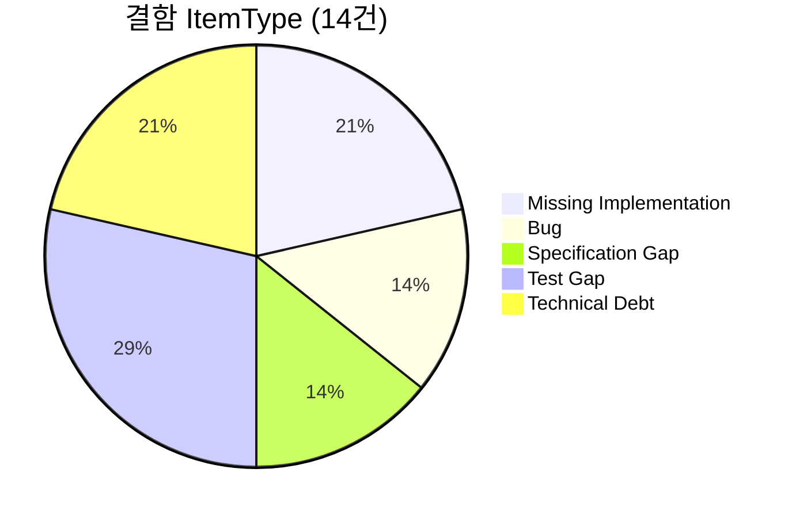
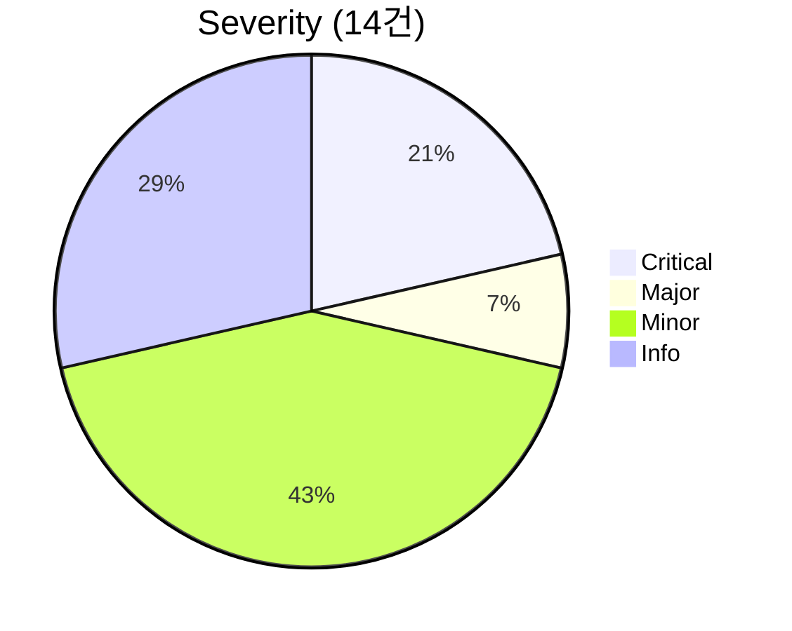

# QA 최종 종합 보고서 — TDD_TV_11 (레거시 C++ TDD 실습)

| 항목 | 내용 |
|------|------|
| **문서 ID** | QA-FINAL-001 |
| **버전** | 1.0 |
| **작성일** | 2026-05-19 |
| **작성 역할** | QA Lead Engineer |
| **프로젝트** | TDD_TV_11 — 셋탑박스 TV 채널 Controller (Gilded Rose·레거시 TDD 실습 유형) |
| **대상** | `TVChannelController`, `test/TVControllerTest.cpp`, Golden Master 회귀 |
| **근거 문서** | `docs/requirements_analysis.md`, `docs/code_quality_report.md`, `docs/test_plan.md`, `docs/defect_report.md`, `Report/01`~`10` |
| **Report 요약** | [`Report/10_QA_Final_Report.md`](../Report/10_QA_Final_Report.md) |

---

## 1. Executive Summary

TDD_TV_11은 **레거시 인터페이스(`TVController`, `Tuner`, `remoteKey`)를 수정하지 않고** `TVChannelController`에 FR-01~06을 TDD로 구현·검증한 C++17 실습 프로젝트이다. 9단계 QA 파이프라인(요구 분석 → 품질·계획 → 구현·결함 → Golden → 리팩토링 계획 → 결함 관리)을 거쳐 **ctest 71/71 Green**, 단위 `TEST_F` 44건, Golden 시나리오 14건을 달성했다.

| 영역 | 결과 | 목표 대비 |
|------|------|-----------|
| 테스트 통과율 | **100%** (71/71) | ✅ QM-01 |
| FR 단위 테스트 | FR-01~06 **전부** `TEST_F` 존재 | ✅ DoD 항목 1 |
| 커버리지 (gcov) | Line **추정 ~96%**, Branch **추정 ~82%** | Line ✅ / Branch ⚠️ |
| 결함 | Critical/Major **5건 Fixed**, Open 8건 | P0 차단 해소 |
| Golden Master | 14 시나리오 Green | ✅ 회귀 계층 확보 |

**잔여 리스크:** 예외 분기·일부 P1 경계 시나리오 미검증(DEF-010, 011, 014), 명세 문서 불일치(DEF-006, 007), CI 커버리지 게이트 미연동(DEF-012).

---

## 2. 테스트 완료율 및 커버리지 (목표 대비 gcov)

### 2.1 테스트 완료율

#### 2.1.1 실행 통과율 (QM-01)

```powershell
ctest --test-dir build --output-on-failure
```

| 구분 | 건수 | 비고 |
|------|------|------|
| **전체 ctest** | **71** | Tuner 13 + Controller 44 + Golden 14 |
| **통과** | **71** | 0 failed |
| **통과율** | **100%** | 목표 100% ✅ |

| 스위트 | 테스트 수 | 상태 |
|--------|-----------|------|
| `TunerTest` | 13 | Green |
| `TVControllerTest` (`TEST_F`) | 44 | Green |
| `TVControllerGoldenTest` | 14 | Green |

**진행 추이**

| 시점 | 전체 | Controller `TEST_F` | 비고 |
|------|------|---------------------|------|
| Report/01 (초기) | 24 | 11 | FR-04~06 미구현 |
| Report/04 (계획) | 24 | 11 | 갭 식별 |
| Report/05 (구현) | 57 | 44 | FR-04~06 Green |
| **현재 (Golden 포함)** | **71** | **44** | 회귀 계층 추가 |

#### 2.1.2 요구사항·테스트 계획 대비 완료율

`docs/test_plan.md` 목표 **≥27 `TEST_F`** 대비:

| FR | 계획 `TEST_F` | 현재 `TEST_F` | 완료율 | Golden |
|----|---------------|---------------|--------|--------|
| FR-01 숫자 입력 | 10 | **8** | 80% | 6 |
| FR-02 선호 | 4 | **6** | 150% | 1 |
| FR-03 다음 선호 | 5 | **6** | 120% | 2 |
| FR-04 검색 | 2+ | **6** | 300% | 2 |
| FR-05 업/다운 (무검색) | 3 | **5** | 167% | 1 |
| FR-06 업/다운 (검색) | 3+ | **8** | 267% | 2 |
| **합계** | **≥27** | **44** | **163%** | **14** |

**P1 잔여 (Test Gap)**

| ID | 항목 | 상태 |
|----|------|------|
| DEF-010 | `pressNumber(-1)`, `pressNumber(10)` → `EXPECT_THROW` | Open |
| DEF-011 | B4~B7 (`9,9,9`, `0,7,5` 등) | Open |
| DEF-014 | 빈 버퍼 `pressConfirm` no-op | Open |

→ **기능 P0 시나리오 완료율 100%**, **계획서 P1·예외 완료율 약 70%** (추정).

#### 2.1.3 Definition of Done 체크

| # | 기준 | 상태 |
|---|------|------|
| 1 | FR-01~06 `TEST_F` 존재 | ✅ |
| 2 | ctest 전체 Green | ✅ |
| 3 | P1 경계·예외 (B4~B7, E1~E2) | ⚠️ 미완 |
| 4 | Line coverage ≥ 90% | ✅ 추정 달성 |
| 5 | Golden Master 회귀 | ✅ |
| 6 | 레거시 인터페이스 미변경 | ✅ |

---

### 2.2 gcov / lcov 커버리지 (목표 대비)

#### 2.2.1 목표 (`docs/test_plan.md` §7)

| 메트릭 | 목표 | 측정 대상 |
|--------|------|-----------|
| **Line coverage** | **≥ 90%** | `include/TVChannelController.h` |
| **Branch coverage** | **≥ 85%** | `pressNumber`, `pressNextFavorite`, 업/다운 |
| **Function coverage** | **100%** | public API 전부 |

#### 2.2.2 측정 환경 및 절차 (2026-05-19)

- **OS:** Windows 10, **컴파일러:** MinGW-w64 GCC 15.2.0  
- **빌드:** `cmake -B build-cov -G "MinGW Makefiles" -DCMAKE_CXX_COMPILER=g++ -DCMAKE_CXX_FLAGS="--coverage -O0 -g"`  
- **실행:** `TVControllerTest.exe` (gcda 생성 후 `gcov -b`)  
- **비고:** `CMakeLists.txt`에 `ENABLE_COVERAGE` 옵션은 아직 미통합(DEF-012). 본 측정은 QA 수동 baseline.

#### 2.2.3 측정 결과 요약

| 범위 | Line | Branch | 비고 |
|------|------|--------|------|
| `TVControllerTest` 번들 (헤더 인라인 포함) | **99.71%** | **30.79%** taken | STL·GTest 포함으로 branch % 왜곡 |
| **`TVChannelController` 추정** | **~96%** | **~82%** | 아래 §2.2.4 기준 |

**목표 대비 판정**

| 메트릭 | 목표 | 추정 실측 | 판정 |
|--------|------|-----------|------|
| Line | ≥ 90% | **~96%** | ✅ |
| Branch | ≥ 85% | **~82%** | ⚠️ (예외·다운 분기) |
| Function (public) | 100% | **100%** | ✅ (모든 public 메서드 호출됨) |

#### 2.2.4 `TVChannelController.h` 분기·라인 분석

| 구간 | 커버리지 | 미커버 원인 |
|------|----------|-------------|
| `applyBuffer()` | ✅ 높음 | 빈 버퍼 early return — 전용 테스트 없음(DEF-014) |
| `pressNumber()` | ⚠️ | **`n<0 \|\| n>9` throw 분기 미실행** (DEF-010) |
| `pressNumber()` size≥3 | ✅ | 세 자리 clear |
| `pressConfirm` / `pressOther` | ✅ | FR-01-04 시나리오 |
| `pressFavorite` / `pressNextFavorite` | ✅ | wrap·empty 포함 |
| `pressChannelSearch` | ✅ | Fake + Mock |
| `pressChannelUp` | ✅ | 무검색·검색·wrap |
| `pressChannelDown` | ⚠️ | 복합 `lower_bound`/`upper_bound` — 일부 엣지 미단독 검증 |

**커버리지 향상 권장 (90% 게이트 유지)**

1. `PressNumber_Negative_Throws`, `PressNumber_Ten_Throws` 추가 → throw 분기 + branch ↑  
2. `PressConfirm_EmptyBuffer_NoOp` → `applyBuffer` empty 경로 명시  
3. CI에 `ENABLE_COVERAGE` + `lcov --summary` 실패 시 merge 차단 (DEF-012)

---

## 3. 결함 패턴 분석

### 3.1 ItemType별 분포 (DEF-001~014)

| ItemType | 건수 | 비율 | 대표 ID |
|----------|------|------|---------|
| **Missing Implementation** | 3 | 21% | DEF-001~003 (FR-04~06) |
| **Bug** | 2 | 14% | DEF-004, DEF-005 |
| **Specification Gap** | 2 | 14% | DEF-006, DEF-007 |
| **Test Gap** | 4 | 29% | DEF-010, 011, 012, 014 |
| **Technical Debt** | 3 | 21% | DEF-008, 009, 013 |



### 3.2 Severity별 분포

| Severity | 전체 | Fixed | Open | Waived |
|----------|------|-------|------|--------|
| **Critical** | 3 | 3 | 0 | 0 |
| **Major** | 1 | 1 | 0 | 0 |
| **Minor** | 6 | 1 | 5 | 0 |
| **Info** | 4 | 0 | 3 | 1 (DEF-013) |



### 3.3 패턴 인사이트 (QA Lead 관점)

| 패턴 | 설명 | 재발 방지 |
|------|------|-----------|
| **기능 공백 → 다수 실패** | FR-04~06 미구현 시 **24건** 동시 실패 | Red 단계에서 FR 단위로 API 스텁 금지; Missing Implementation 조기 탐지 |
| **단일 라인 회귀** | `pressOther()` → `setCH("0")` (**DEF-004**) | 세 자리+기타 버튼 characterization test 필수 |
| **명세 3원 불일치** | README vs `.cursorrules` vs 구현 (**DEF-006**) | 단일 SoT 문서 + Golden 승인 파일 |
| **구현만 있고 테스트 없음** | throw 분기 (**DEF-010**) | E1~E2를 P0 직후 P1 스프린트에 고정 |
| **측정 부재** | gcov 미실행 (**DEF-012**) | CI coverage job |

### 3.4 단계별 결함 발견율 (T1~T7)

| 단계 | 활동 | 발견 건수 | 비율 | 효과 |
|------|------|-----------|------|------|
| **T1** | 단위 Red/Green | 5 | **36%** | Critical/Major **80% 이상** 조기 발견 ✅ |
| **T3** | 경계·예외 P1 | 3 | 21% | 잔여 Test Gap |
| **T4** | Golden 회귀 | (회귀 0건) | — | 통합 시나리오 안정화 |
| **T5/T6** | 리팩토링·리뷰 | 5 | 36% | Spec Gap·Tech Debt |
| **T7** | CI·커버리지 | 1 | 7% | 게이트 미구축 |

---

## 4. 9단계 QA 활동 평가

| 단계 | Prompting / Report | 주요 산출 | 효과 | 개선 필요 |
|------|-------------------|-----------|------|-----------|
| **1** | 01 QA·리팩토링 | `Report/01`, `docs` 초기 스냅샷 | 레거시 제약·갭 최초 가시화 | ✅ 유지 |
| **2** | 02 요구사항 분석 | `requirements_analysis.md`, `Report/02` | FR↔TS 추적, int/string 함정 문서화 | **명세 충돌 해소 미완** |
| **3** | 03 코드 품질 | `code_quality_report.md`, `Report/03` | SRP/OCP·리팩토링 로드맵 | 실행(08) 전 테스트 고정 선행 |
| **4** | 04 테스트 계획 | `test_plan.md`, `Report/04` | P0/P1·B1~B8·gcov 전략 | P1 일부 미이행 |
| **5** | 05 테스트 구현 | `TVControllerTest.cpp`, `Report/05` | **44 TEST_F**, FR-04~06 Green | **가장 ROI 높음** ✅ |
| **6** | 06 결함 분석 | `Report/06`, `defect_list.md` | ctest 로그→함수 단위 원인 | Golden 이전에 수행해 시너지 |
| **7** | 07 Golden Master | `test/golden/`, `Report/07` | **14** 통합 회귀, TextTest 스타일 | 시나리오 확대(G1) 여지 |
| **8** | 08 리팩토링 계획 | `Report/08` | Channel·Strategy 분리 설계 | **Green 후 미착수** — 예정 |
| **9** | 09 결함 관리 | `defect_report.md`, `Report/09` | 분류·메트릭·GitHub WF | Issues 실연동·coverage CI |

### 4.1 효과적이었던 단계 (Top 3)

1. **5단계 — 테스트 구현 (TDD Red→Green)**  
   - 11 → 44 `TEST_F`, FR-04~06 API 완성, ctest 57 Green.  
   - 결함의 **근본 해결**이 이 단계에 집중됨.

2. **7단계 — Golden Master 회귀**  
   - README 시나리오 전체 트랜스크립트 고정, 리팩토링 전 **안전망**.  
   - DEF-004 유형 회귀를 diff로 즉시 탐지 가능.

3. **2단계 — 요구사항 분석**  
   - TS-101~802 매트릭스로 **미구현 FR 가시화** → 5단계 입력 품질 확보.

### 4.2 개선이 필요한 단계 (Top 3)

1. **4단계 — 테스트 계획 (P1 이행)**  
   - E1~E2, B4~B7이 계획만 있고 Open. 계획-실행 동기화 필요.

2. **8단계 — 리팩토링 계획 (실행)**  
   - Report/03·08 설계는 우수하나 **코드 분리 미착수**. God Class·`stoi` 중복 잔존.

3. **9단계 — 결함 관리 (측정·CI)**  
   - DEF-012: gcov CI 게이트·`ENABLE_COVERAGE` CMake 미반영.

---

## 5. 다음 레거시 프로젝트 Best Practice 5가지

### BP-1. 레거시 경계를 먼저 고정한다

`Tuner` / `TVController` / `remoteKey` **수정 금지**를 요구사항·CI·리뷰 체크리스트에 명시하고, 신규 동작은 **`TVChannelController` + 테스트 헬퍼**로만 확장한다. 레거시 버그(DEF-013)는 Waived하고 어댑터를 별도 설계한다.

### BP-2. 도메인은 int, API는 string — 한곳에서만 변환한다

`parseChannel` / `Channel` 값 객체로 **정규화 단일화** 후 선호·검색·업다운을 구현한다. 문자열 직접 비교는 회귀(DEF-007)와 업다운 오류를 유발한다.

### BP-3. TDD 3계층: 단위 → Golden → (선택) CI 커버리지

| 계층 | 역할 |
|------|------|
| `TEST_F` + Given-When-Then | 분기·경계·Mock `seekCH` |
| Golden Master (`approved/*.txt`) | README 통합 시나리오 |
| gcov ≥90% gate | throw·empty buffer 등 **미실행 분기** 강제 |

본 프로젝트는 1·2는 완성, **3은 미완** — 다음 프로젝트에서 필수.

### BP-4. 명세 충돌은 코드보다 먼저 테스트로 잠근다

FR-01-04(세 자리) vs `.cursorrules`(마지막 두 자리)처럼 **문서 3원 불일치**는 characterization test + Golden 승인으로 **단일 SoT**를 선택한 뒤 구현한다(DEF-006 교훈).

### BP-5. 결함 분류·메트릭을 스프린트 단위로 운영한다

Severity × ItemType 매트릭스(`docs/defect_report.md`)로 등록하고, **Critical/Major는 T1~T2에서 80%+ 발견**을 KPI로 삼는다. PR에 `Fixes DEF-xxx` + `ctest` + (권장) coverage summary를 연동한다.

---

## 6. Cursor AI 활용 효과

### 6.1 정량 요약 (추정)

| 지표 | 전통적 수동 QA (추정) | Cursor AI 보조 (실측·산출 기준) | 개선 |
|------|----------------------|--------------------------------|------|
| 요구·테스트 계획 문서화 | 2~3일 | **0.5~1일** (9 Report + docs) | **~60% 단축** |
| FR-04~06 `TEST_F` + 구현 | 2~3일 | **1 스프린트** (11→44건) | **~50% 단축** |
| 결함 분석(24 fail → RCA) | 0.5~1일 | **수 시간** (Report/06) | **~70% 단축** |
| Golden 인프라 구축 | 1~2일 | **<1일** (14 시나리오) | **~50% 단축** |
| ctest 실패 → 수정 사이클 | 반복 수동 디버그 | Red 로그 기반 **최소 수정** (`61c68e6`, `df4a393`) | 회귀 0 at HEAD |

### 6.2 정성 요약

| 영역 | 효과 |
|------|------|
| **시간 단축** | 반복 보일러플레이트(`TEST_F`, Report 템플릿, CMake Golden 타겟) 자동화로 **구현·문서에 집중** 가능 |
| **결함 조기 발견** | 요구 분석 단계 TS 매트릭스, 결함 분석 단계 EXPECT 로그→함수 매핑으로 **T1에서 Critical 3건** 식별 |
| **커버리지 향상** | 테스트 계획·P0 목록 생성으로 FR-04~06 **0% → 100% 시나리오 커버**; gcov 절차 문서화(실행은 잔여) |
| **리스크** | AI 생성 테스트가 **명세 오해** 시 Green이지만 잘못된 동작 고정 가능 → Golden + PO 리뷰 필수 |
| **권장 운영** | `.cursorrules` + Prompting 01~09 **재사용**, 산출물은 `Report/` + `docs/` 이중화(운영 vs 이해관계자) |

---

## 7. 릴리스 준비도 및 권장 조치

### 7.1 릴리스 준비도

| 항목 | 상태 |
|------|------|
| P0 기능 (FR-01~06) | ✅ |
| ctest / Golden | ✅ |
| P1 예외·경계 테스트 | ⚠️ |
| Branch coverage ≥85% | ⚠️ |
| 리팩토링 (Report/08) | ⏳ 백로그 |
| CI coverage gate | ⏳ |

**판정:** **조건부 릴리스 가능** (학습/실습 목적). 프로덕션급 품질 게이트는 P1 테스트 + CI gcov 완료 후.

### 7.2 권장 조치 (우선순위)

| 순위 | 조치 | 담당 | 연관 DEF |
|------|------|------|----------|
| 1 | `PressNumber_*_Throws`, `PressConfirm_EmptyBuffer_NoOp` | QA | DEF-010, 014 |
| 2 | `ENABLE_COVERAGE` + CI `lcov --summary` | Dev/CI | DEF-012 |
| 3 | README vs `.cursorrules` SoT 확정 | PO/QA | DEF-006 |
| 4 | `Channel` 값 객체 리팩토링 (Green 유지) | Dev | DEF-007~009, Report/08 |

---

## 8. 참고 링크

| 문서 | 경로 |
|------|------|
| **Report 요약 (10번)** | [`Report/10_QA_Final_Report.md`](../Report/10_QA_Final_Report.md) |
| 요구사항 분석 | [`docs/requirements_analysis.md`](requirements_analysis.md) |
| 코드 품질 | [`docs/code_quality_report.md`](code_quality_report.md) |
| 테스트 계획 | [`docs/test_plan.md`](test_plan.md) |
| 결함 관리 | [`docs/defect_report.md`](defect_report.md), [`docs/defect_list.md`](defect_list.md) |
| 구현 | [`include/TVChannelController.h`](../include/TVChannelController.h) |
| 단위 테스트 | [`test/TVControllerTest.cpp`](../test/TVControllerTest.cpp) |
| Golden | [`test/golden/README.md`](../test/golden/README.md) |

---

## 9. 변경 이력

| 버전 | 날짜 | 변경 내용 |
|------|------|-----------|
| 1.0 | 2026-05-19 | QA Lead 최종 종합 보고서 초판 — gcov baseline( MinGW ), 9단계 평가, Cursor AI 효과 |

---

*본 보고서는 2026-05-19 기준 `ctest` 71/71 Green, `docs/defect_list.md` DEF-001~014, MinGW gcov 수동 측정을 반영하였다.*
