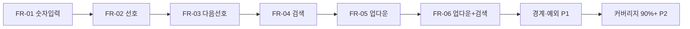

# TV Channel Controller — 단위 테스트 계획서

| 항목 | 내용 |
|------|------|
| **문서 버전** | 1.0 |
| **작성 역할** | 시니어 QA 리드 |
| **대상 모듈** | `TVChannelController` (`include/TVChannelController.h`) |
| **테스트 스위트** | `test/TVControllerTest.cpp` |
| **요구사항 기준** | `TDD_TV_Requirements.txt` (FR-01 ~ FR-06) |
| **기술 스택** | C++17, Google Test / Google Mock, CMake, (선택) gcov / lcov |

---

## 1. 목적 및 범위

본 문서는 TDD_TV_11 프로젝트의 **Controller 단위 테스트** 범위, 우선순위, 경계값·예외 시나리오, 커버리지 목표 및 측정 전략을 정의한다.

### 1.1 테스트 대상 (In Scope)

| 구분 | 포함 | 비고 |
|------|------|------|
| `TVChannelController` 공개 API | ✅ | `pressNumber`, `pressConfirm`, `pressOther`, `pressFavorite`, `pressNextFavorite`, `addFavorite`, `getFavoriteChannels` |
| Tuner 연동 | ✅ | `FakeTuner` 기본, FR-04는 `MockTuner`로 `seekCH` 검증 |
| 채널 범위 | ✅ | 0 ~ 99 (일반 채널 100개) |
| Given-When-Then | ✅ | 요구사항 4.2 준수 |

### 1.2 테스트 제외 (Out of Scope)

| 구분 | 제외 사유 |
|------|-----------|
| `Tuner` 실구현체 | 외부 제공, 본 프로젝트 범위 외 (`TunerTest.cpp`는 Mock 사용법 참고용) |
| `TVController` 레거시 (`pushButton` / `remoteKey`) | 수정 금지, `TVChannelController`가 실제 검증 대상 |
| `remoteKey` enum 확장 | 수정 금지; 상위 매핑 레이어는 별도 과제 |
| 하드웨어·리모컨 센서 드라이버 | 키 값이 Controller API로 전달된다고 가정 |

---

## 2. 테스트 픽스처 및 공통 전략

### 2.1 `ControllerTest` 픽스처 (`TEST_F`)

```cpp
class ControllerTest : public ::testing::Test {
protected:
  std::unique_ptr<FakeTuner> tuner;
  std::unique_ptr<TVChannelController> ctrl;

  void SetUp() override {
    tuner = std::make_unique<FakeTuner>(std::vector<int>{1, 4, 12, 56});
    ctrl = std::make_unique<TVChannelController>(*tuner);
  }
};
```

| 항목 | 정책 |
|------|------|
| **픽스처 이름** | `ControllerTest` (기존 유지) |
| **기본 Tuner** | `FakeTuner({1, 4, 12, 56})` — 선호/검색 시나리오와 README 예시 정합 |
| **검증 수단** | `tuner->getCurrentCH()` 및 `ctrl->getFavoriteChannels()` |
| **Mock 사용** | `MockTunerForController` — FR-04 (`seekCH` 호출 횟수·인자) 전용 서브픽스처 또는 별도 `TEST_F` 클래스 권장 |
| **네이밍** | `기능영역_조건_기대결과` (예: `Press1Then2_AutoChange`) |
| **케이스 분리** | 검증하는 **채널 값·상태마다 별도 `TEST_F`** (요구사항 4.2) |

### 2.2 Given-When-Then 템플릿

각 `TEST_F` 본문에 아래 주석 구조를 유지한다.

```cpp
TEST_F(ControllerTest, Example) {
  // Given: 초기 채널·선호 목록·검색 결과 등
    tuner->setCH("6");
  // When: 사용자 입력 시퀀스
    ctrl->pressNumber(1);
    ctrl->pressConfirm();
  // Then: Tuner 채널 또는 Controller 내부 상태
    EXPECT_EQ("1", tuner->getCurrentCH());
}
```

### 2.3 TDD 실행 순서

1. 요구사항 ID(FR-xx)에 대응하는 **실패하는 테스트 추가** (Red)
2. `TVChannelController` 최소 구현 (Green)
3. 모든 `ctest` Green 확인 후 리팩토링 (요구사항 4.3)
4. 커버리지 리포트로 미커버 분기 보완

---

## 3. TEST_F 단위 테스트 범위 및 우선순위

우선순위: **P0** = 릴리스 차단(필수 FR), **P1** = 경계·예외·회귀, **P2** = 리팩토링·비기능(커버리지 보강).

### 3.1 FR-01: 숫자 버튼 채널 변경 — **P0**

| ID | TEST_F (현재/계획) | Given | When | Then | 상태 |
|----|-------------------|-------|------|------|------|
| FR-01-01 | `PressNumber1ThenConfirm` | 초기 채널 | `1` → `확인` | 채널 `1` | ✅ 구현 |
| FR-01-02 | `Press1Then2_AutoChange` | 초기 | `1` → `2` | 채널 `12` (확인 없음) | ✅ |
| FR-01-03 | `Press1234_TwoStageChange` | 초기 | `1,2,3,4` | 최종 `34` (중간 `12`) | ✅ |
| FR-01-04a | `ThreeDigits_ApplyFirstTwo` | 초기 | `4,5,6` | 두 자리 적용 후 `45` | ⚠️ 부분 (`OtherButtonCancelsBuffer`만 45 검증) |
| FR-01-04b | `ThreeDigits_ThenConfirm_SingleDigit` | `4,5,6` 후 | `확인` (버퍼에 `6`만) | 채널 `6` | ❌ 미구현 |
| FR-01-04c | `ThreeDigits_ThenOther_ClearsSix` | `4,5,6` 후 | `pressOther` | `45` 유지, `6` 무효 | ✅ |
| FR-01-05 | `Zero7_SingleDigit7` | 초기 | `0` → `7` | 채널 `7` | ✅ |
| FR-01-06 | `SingleDigit0_ThenConfirm` | 초기 | `0` → `확인` | 채널 `0` | ❌ |
| FR-01-07 | `TwoDigits_00_ThenConfirm` | 초기 | `0` → `0` → `확인` | 채널 `0` | ❌ |
| FR-01-08 | `MaxChannel_99_Auto` | 초기 | `9` → `9` | 채널 `99` | ❌ |

### 3.2 FR-02: 선호 채널 추가/삭제 — **P0**

| ID | TEST_F | Then | 상태 |
|----|--------|------|------|
| FR-02-01 | `FavoriteAdd_NewChannel` | 현재 채널이 선호 목록에 포함 | ✅ |
| FR-02-02 | `FavoriteToggle_Remove` | 두 번째 누름 시 목록에서 제거 | ✅ |
| FR-02-03 | `FavoriteToggleScenario` | 복수 채널 토글 후 `{6,12,37}` | ✅ |
| FR-02-04 | `FavoriteAtChannel0` | 채널 `0` 등록/해제 | ❌ P1 |

### 3.3 FR-03: 다음 선호 채널 — **P0**

| ID | TEST_F | Then | 상태 |
|----|--------|------|------|
| FR-03-01 | `NextFavorite_Normal` | 현재 `6`, 선호 `{1,4,12,56}` → `12` | ✅ |
| FR-03-02 | `NextFavorite_WrapAround` | 현재 `56` → `1` | ✅ |
| FR-03-03 | `NextFavorite_EmptyList` | 선호 없음 → 채널 유지 | ✅ |
| FR-03-04 | `NextFavorite_ExactMatchCurrent` | 현재가 선호와 동일 시 다음 상위 | ❌ P1 |
| FR-03-05 | `NextFavorite_SingleFavorite` | 선호 1개만 있을 때 wrap | ❌ P1 |

### 3.4 FR-04: 채널 검색 — **P0** (미착수)

| ID | TEST_F (계획) | Given | When | Then |
|----|---------------|-------|------|------|
| FR-04-01 | `ChannelSearch_StoresAllAvailable` | Mock Tuner, `seekCH`가 순차 반환 | `pressChannelSearch()` (API 추가 예정) | `seekCH` N회 호출, 내부 검색 목록 저장 |
| FR-04-02 | `ChannelSearch_EmptyTuner` | seek 결과 없음 | 검색 | 목록 비어 있음, 예외 없음 |

> **구현 전제**: `TVChannelController`에 검색 결과 `std::vector<int>`(또는 `set`) 및 `pressChannelSearch()` 추가. Tuner는 `MockTunerForController::seekCH`로 검증.

### 3.5 FR-05: 채널 업/다운 (검색 결과 **없음**) — **P0** (미착수)

| ID | TEST_F (계획) | Given | When | Then |
|----|---------------|-------|------|------|
| FR-05-01 | `ChannelUpDown_NoSearch_From6` | 검색 목록 비움, CH=`6` | Up / Down | `7` / `5` |
| FR-05-02 | `ChannelUp_NoSearch_Wrap99to0` | CH=`99` | Up | `0` |
| FR-05-03 | `ChannelDown_NoSearch_Wrap0to99` | CH=`0` | Down | `99` |

### 3.6 FR-06: 채널 업/다운 (검색 결과 **있음**) — **P0** (미착수)

| ID | TEST_F (계획) | Given | When | Then |
|----|---------------|-------|------|------|
| FR-06-01 | `ChannelUpDown_WithSearch_OnList` | 저장 `{4,6,14}`, CH=`6` | Up / Down | `14` / `4` |
| FR-06-02 | `ChannelUpDown_WithSearch_OffList` | 저장 `{4,6,14}`, CH=`15` | Up / Down | `4` / `14` |
| FR-06-03 | `ChannelUpDown_WithSearch_SingleEntry` | 저장 `{7}`, CH=`7` | Up | wrap `7` | ❌ P1 |

### 3.7 우선순위 요약 (실행 순서)



| 우선순위 | 범위 | 테스트 수 (목표) |
|----------|------|------------------|
| **P0** | FR-01 ~ FR-06 README 시나리오 전부 | ≥ 25 `TEST_F` |
| **P1** | 경계값·예외·토글/로테이션 변형 | +10 ~ 15 |
| **P2** | 분기 커버리지·리팩토링 회귀 | 필요 시 Parameterized test |

---

## 4. 경계값 케이스 — 세 자리 숫자 입력 (FR-01-04)

세 번째 숫자 입력 시 구현(`pressNumber`): `buffer.size() >= 3`이면 **버퍼만 clear**하고 채널은 변경하지 않음. 이미 적용된 **두 자리 결과는 유지**된다.

### 4.1 핵심 시나리오 매트릭스

| # | 입력 시퀀스 | 버퍼/적용 단계 | 기대 채널 (Then) | TEST_F |
|---|-------------|----------------|------------------|--------|
| B1 | `4` → `5` → `6` | `45` 자동 적용 후 `6` 입력 시 버퍼 clear | `45` | `ThreeDigits_ApplyFirstTwo` |
| B2 | B1 이후 `확인` | 버퍼에 `6`만 남은 상태에서 apply | `6` | `ThreeDigits_ThenConfirm_SingleDigit` |
| B3 | B1 이후 `pressOther` | `6` 무효화 | `45` (변화 없음) | `OtherButtonCancelsBuffer` ✅ |
| B4 | `9` → `9` → `9` | `99` 적용 후 세 번째 `9`로 clear | `99` | `ThreeDigits_999` |
| B5 | `0` → `7` → `5` | `07`→`7`? (구현: `value=7`) 후 `5` clear | `7` | `ThreeDigits_075` |
| B6 | `1` → `2` → `3` → `확인` | `12` 적용 후 `3` clear → 확인 시 `3` | `3` | `ThreeDigits_123_Confirm` |
| B7 | `1` → `0` → `5` | `10` 자동 적용 후 `5` clear | `10` | `ThreeDigits_105` |
| B8 | 연속 네 자리 `1,2,3,4` | `12`→`34` (FR-01-03) | `34` | ✅ 기존 |

### 4.2 두 자리 자동 적용 경계 (세 자리와 연계)

| # | 입력 | 기대 | 비고 |
|---|------|------|------|
| D1 | `9`,`9` | `99` | 상한 채널 |
| D2 | `0`,`0` | `0` | 하한 |
| D3 | `0`,`7` | `7` | FR-01-05 (선행 0) |
| D4 | `1`,`0` | `10` | |
| D5 | `9`,`0` | `90` | |

### 4.3 채널 범위 경계 (0 ~ 99)

| # | 입력 의도 | 기대 동작 | 우선순위 |
|---|-----------|-----------|----------|
| R1 | 버퍼 합산 > 99 (예: `9`,`9` 후 추가 입력) | 두 자리까지는 `99`; 세 자리는 B4와 동일 | P1 |
| R2 | `FakeTuner::setCH("100")` | `invalid_argument` (Fake에서 거부) | P1 — Tuner 계약 테스트 |

---

## 5. 예외 및 특이 케이스

### 5.1 예외 (Exception) — `EXPECT_THROW`

| # | 조건 | API | 기대 예외 | TEST_F |
|---|------|-----|-----------|--------|
| E1 | `pressNumber(-1)` | `pressNumber` | `std::invalid_argument` ("invalid number") | `PressNumber_Negative_Throws` |
| E2 | `pressNumber(10)` | `pressNumber` | 동일 | `PressNumber_Ten_Throws` |
| E3 | Tuner에 100 설정 시도 | `FakeTuner::setCH` | `invalid_argument` | `FakeTuner_ChannelOutOfRange` (Tuner 계약) |

### 5.2 특이 케이스 (Exception 아님)

| # | 시나리오 | 기대 | 우선순위 |
|---|----------|------|----------|
| S1 | 선호 목록 비어 있을 때 `pressNextFavorite` | 채널 유지 | ✅ |
| S2 | `pressConfirm` on empty buffer | no-op, 채널 유지 | P1 |
| S3 | `pressOther` on empty buffer | no-op | P1 |
| S4 | 세 자리 후 **숫자만** 다시 입력 (`6` 후 `8`) | 새 버퍼 `8`, 두 자리 미만이면 미적용 | P1 |
| S5 | 동일 채널 연속 `pressFavorite` | 토글 off | ✅ |
| S6 | `getFavoriteChannels` 순서 | `std::set` 기반 — **정렬 오름차순** 검증 | P1 |
| S7 | 현재 채널이 선호에 없을 때 `pressNextFavorite` | `upper_bound`로 최소 상위 | P0 (FR-03-01) |
| S8 | 검색 목록 있을 때 FR-05 단순 증감과 FR-06 목록 이동 **상호 배타** | 검색 있으면 FR-06만 | P0 |
| S9 | `stoi(tuner_.getCurrentCH())` — 비숫자 문자열 | 미정의(레거시 Tuner 가정: 항상 숫자) | 문서화만 |

### 5.3 Mock / Fake 선택 가이드

| 시나리오 | Double | 이유 |
|----------|--------|------|
| FR-01, 02, 03, 05, 06 (상태 검증) | `FakeTuner` | `getCurrentCH` / `setCH` 실동작 |
| FR-04 | `MockTunerForController` | `EXPECT_CALL(seekCH())` 횟수·순서 |
| Tuner 미호출 보장 | GMock `NiceMock` + strict | 불필요한 `setCH` 호출 감지 |

---

## 6. 요구사항 추적 매트릭스

| 요구 ID | TEST_F 수 (현재) | TEST_F 수 (목표) | 커버리지 비고 |
|---------|------------------|------------------|---------------|
| FR-01 | 5 | 10 | 세 자리+확인 케이스 보강 |
| FR-02 | 3 | 4 | 채널 0 |
| FR-03 | 3 | 5 | 단일 선호·동일 채널 |
| FR-04 | 0 | 2+ | API·Mock 신규 |
| FR-05 | 0 | 3 | API 신규 |
| FR-06 | 0 | 3+ | 검색 목록 fixture |
| **합계** | **11** | **≥ 27** | |

---

## 7. 커버리지 목표 및 gcov/lcov 전략

### 7.1 목표

| 메트릭 | 목표 | 측정 대상 |
|--------|------|-----------|
| **Line coverage** | **≥ 90%** | `TVChannelController.h` 내 구현 (헤더 only 구현) |
| **Branch coverage** | **≥ 85%** | `pressNumber` 분기, `pressNextFavorite`, 업/다운 분기 |
| **Function coverage** | **100%** | public 메서드 전부 |
| **제외** | — | `TVController.h`, `Tuner.h`, `remoteKey.h`, gtest 자체 |

현재 CMake에는 커버리지 플래그가 없으므로, 아래를 **Debug + Coverage** 빌드 타입으로 추가한다.

### 7.2 CMake 설정 (권장)

```cmake
option(ENABLE_COVERAGE "Build with gcov coverage" OFF)

if(ENABLE_COVERAGE AND CMAKE_CXX_COMPILER_ID MATCHES "GNU|Clang")
  add_compile_options(--coverage -O0 -g)
  add_link_options(--coverage)
endif()
```

Windows에서는 **MinGW-w64 GCC** 또는 **WSL/Linux**에서 gcov/lcov 실행을 권장한다. MSVC는 gcov 대신 OpenCppCoverage 등 별도 도구가 필요하다.

### 7.3 빌드·측정·리포트 절차 (Linux / WSL)

```bash
cmake -B build-cov -DENABLE_COVERAGE=ON -DCMAKE_BUILD_TYPE=Debug
cmake --build build-cov
cd build-cov && ctest --output-on-failure

# gcov 데이터 수집 (실행 파일별)
./TVControllerTest
lcov --capture --directory . --output-file coverage.info
lcov --remove coverage.info '/usr/*' '*/googletest/*' '*/test/*' \
     --output-file coverage.filtered.info
genhtml coverage.filtered.info --output-directory coverage_html
```

**Windows (MinGW)** 예시:

```powershell
cmake -B build-cov -G "MinGW Makefiles" -DENABLE_COVERAGE=ON
cmake --build build-cov
.\build-cov\TVControllerTest.exe
# gcov는 .gcda 생성 후 lcov 또는 gcovr 사용
gcovr -r .. --html --html-details -o coverage.html
```

### 7.4 커버리지 개선 전략

| 단계 | 활동 | 담당 |
|------|------|------|
| 1. Baseline | 최초 `lcov` 리포트, 미커버 라인 목록화 | QA |
| 2. P0 테스트 | FR-04~06 Red→Green 후 재측정 | Dev |
| 3. 분기 보강 | `buffer.size()>=3`, `favorites.empty()`, 검색 유무 분기 | QA |
| 4. 회귀 게이트 | CI에서 `lcov --summary` 실패 시 merge 차단 (line < 90%) | CI |
| 5. 리팩토링 | Green 유지하며 중복 제거, 커버리지 재확인 | Dev |

**예상 미커버 구간 (현재 구현 기준)**

- `pressNumber`: `n < 0 || n > 9` throw 분기
- `pressNumber`: `buffer.size() >= 3` early return
- `applyBuffer`: `buffer.empty()` (간접 호출)
- `pressNextFavorite`: `upper_bound` vs wrap (`it == end`)
- 미구현: FR-04~06 전체

### 7.5 CI 품질 게이트 (권장)

```bash
lcov --summary coverage.filtered.info | tee summary.txt
# line coverage >= 90% 파싱 후 실패 처리 (스크립트)
ctest --output-on-failure
```

---

## 8. 실행 및 완료 정의 (DoD)

| # | 완료 기준 |
|---|-----------|
| 1 | FR-01 ~ FR-06 README 시나리오별 `TEST_F` 존재 |
| 2 | `ctest` / `TVControllerTest` 전체 **Green** |
| 3 | 세 자리 입력 B1~B7 및 예외 E1~E2 테스트 통과 |
| 4 | Line coverage **≥ 90%** (`TVChannelController` 기준) |
| 5 | `Tuner` / `TVController` / `remoteKey` **인터페이스 미변경** |
| 6 | Controller는 Tuner API만 통해 채널 변경 (Mock/Fake로 검증) |

---

## 9. 부록: 현재 테스트 스위트 스냅샷

`test/TVControllerTest.cpp` 기준 **11**개 `TEST_F` (2026-05-19):

- FR-01: 5건 ✅  
- FR-02: 3건 ✅  
- FR-03: 3건 ✅  
- FR-04 ~ FR-06: 0건 ❌  

`MockTunerForController`는 선언만 되어 있으며 FR-04 구현 시 활성화한다.

---

## 10. 변경 이력

| 버전 | 날짜 | 변경 내용 |
|------|------|-----------|
| 1.0 | 2026-05-19 | 초안 작성 — 요구사항·기존 테스트·구현 분석 반영 |
